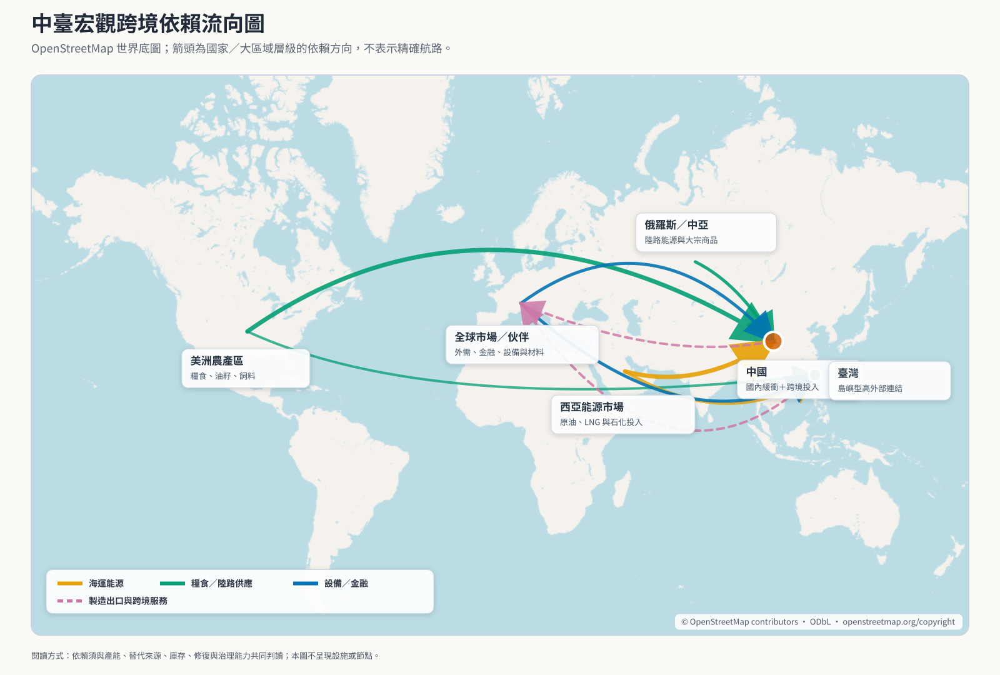
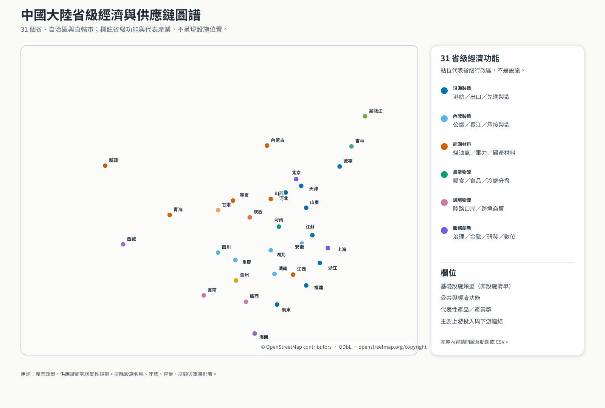
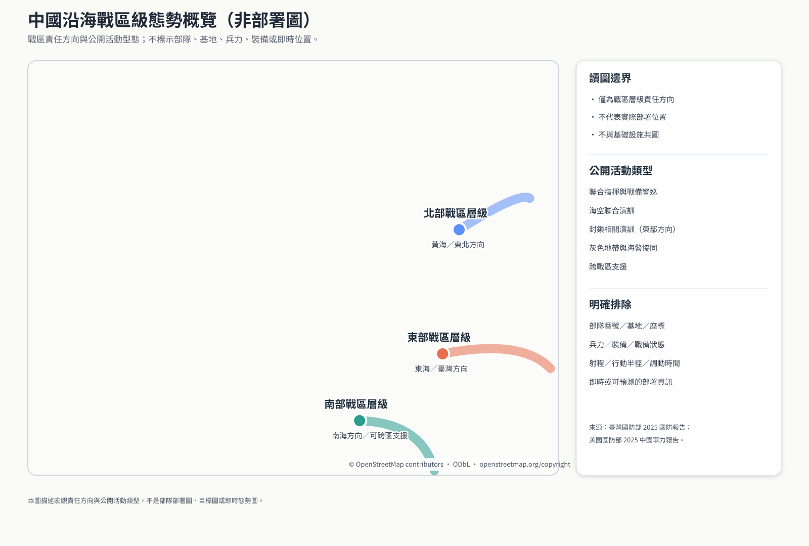
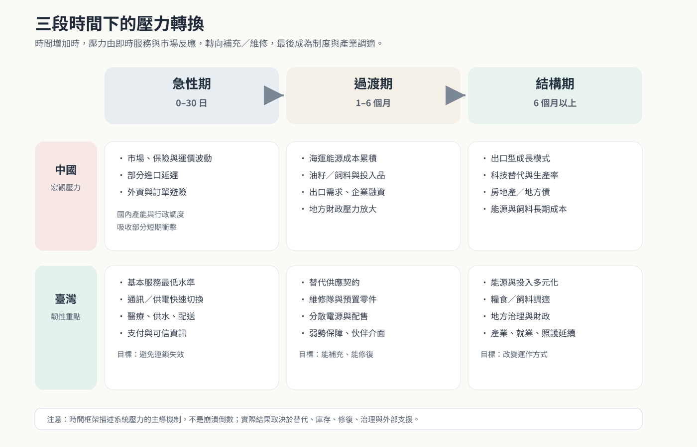
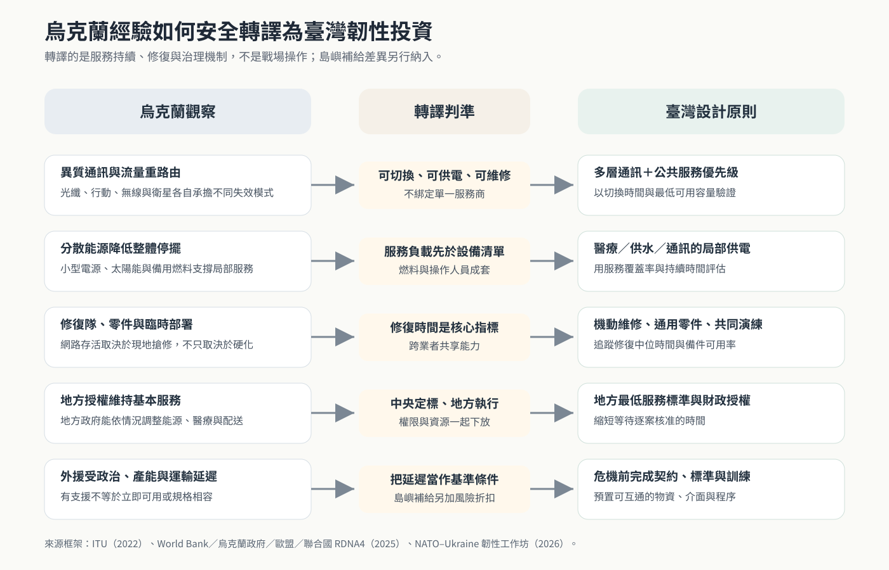

# 臺海長期衝突下的中臺戰略依賴、非動能制衡與國家韌性

**版本：** v1.1 研究底稿  
**資料截止：** 2026-08-13（Asia/Taipei）  
**研究性質：** 公開資料政策分析；非作戰、非目標化研究

## Responsible Use

本報告用於民防、公共政策、供應鏈與關鍵服務持續運作。全文不提供設施座標、軍事目標、攻擊排序、武器選擇、破壞方法或癱瘓估算。「暴露」僅指封鎖、制裁、交通受限、網路干擾或市場衝擊下的系統壓力，不代表軍事目標價值。若引用本報告，應保留此限制。

## 摘要

本研究比較臺灣與中國在能源、糧食、海運、貿易金融、科技投入及數位通訊上的跨境依賴，並以 0–30 日、1–6 個月與 6 個月以上三個階段分析壓力如何轉換。結果顯示，兩岸不存在對稱的「單一弱點」。臺灣的急性風險較集中：2025 年進口能源占總能源供給 95.4%，熱量口徑糧食自給率亦偏低，島嶼物流使能源、民生物資與產業投入同時受海運條件約束。中國則具有龐大國內能源、糧食、工業及政策調度能力，但其海運原油、外需、進口油籽與部分先進科技投入，會在衝突延長時累積壓力。中國 2024 年原油進口為每日 1,110 萬桶，其中 92% 經海運；同年貨品出口達 3.5765 兆美元。

烏克蘭經驗顯示，韌性並不只來自設施硬化。可重路由的通訊、分散能源、預置零件、可迅速調度的修復隊、地方決策權，以及政府與民間業者的共同演練，同樣決定基本服務能否持續。對臺灣而言，最重要的政策結論不是假設外援必然抵達，而是把外援延遲視為基準情境，在危機前完成庫存、契約、標準、維修與跨國協調。

**關鍵詞：** 臺海安全、全社會防衛韌性、戰略依賴、供應鏈、能源安全、烏克蘭、非動能制衡

## 一、問題界定：公開軍事活動不等於已確認開戰動員

中國官方文件把「和平統一」稱為處理臺灣問題的基本原則；同時，《反分裂國家法》第八條保留在特定條件下採取「非和平方式」的法律空間（國務院新聞辦公室, 2022；全國人民代表大會, 2005）<!--ref:prc_whitepaper2022--><!--anchor:section:Peaceful%20reunification--><!--ref:prc_asl2005--><!--anchor:section:Article%208-->。這兩項材料只能證明官方立場與法律框架，不能單獨推定近期決策。

臺灣國防部與美國國防部的公開報告則顯示，共軍近年演練已包含聯合封鎖及其他對臺施壓選項（中華民國國防部, 2025；美國國防部, 2025）<!--ref:mnd_ndr2025--><!--anchor:section:Joint%20blockades--><!--ref:usdod_cmp2025--><!--anchor:page:45-->。這足以支持「威脅升高且能力持續演練」的判斷，卻不足以從單日艦機數或一次軍演宣告「入侵動員已開始」。

因此，本研究採兩個判準：

1. 將日常化軍事壓力、封鎖演練與真正的跨領域戰時動員分開。
2. 只有政治、法律、軍事、民用運輸、物資、金融與資訊等多類訊號同時偏離常態，才提高對迫近危機的信心。

截至 2026-08-12，本報告檢視的公開材料支持「灰色地帶壓力與封鎖能力演練已常態化」，但不足以獨立證實中國已啟動一場特定日期的侵臺總動員。這個區分不是淡化風險，而是避免錯誤預警消耗社會信任。

## 二、研究方法

研究採 structured-focused comparison，比較兩岸同一組依賴部門，並把可觀測依賴與分析判斷分開。資料優先序為：官方統計與法律、國際組織資料、具方法說明的政府評估、官方政策說明。資料以 2024–2026 年為主；烏克蘭案例從 2022 年全面戰爭後起算。

每一部門使用六個問題：外部供應占比多高、來源是否集中、替代速度如何、是否有國內產能或庫存緩衝、治理與修復能力如何，以及壓力在何時變得顯著。表中的「低、中、高」是透明的分析標記，不是統計估計，也不能用來推論設施級效果。

## 三、宏觀戰略依賴圖

**圖 1 說明。** 底圖採 OpenStreetMap 世界地圖（© OpenStreetMap contributors；ODbL）。箭頭表示國家或大區域之間的能源、糧食、科技投入、製造與金融連結，不代表精確航路。圖中刻意不標示港口、海纜登陸站、管線、電廠或其他設施位置。

### 3.1 中國：高外部連結，加上高國內緩衝

**能源。** 中國 2024 年進口每日 1,110 萬桶原油，92% 經海運抵達；俄羅斯與沙烏地阿拉伯分占主要來源的 20% 與 14%（EIA, 2025）<!--ref:eia_china2025--><!--anchor:section:Energy%20Trade-->。然而，中國不是單純的進口型能源系統。中國國家統計局報告 2025 年一次能源產量為 51.3 億噸標準煤，原煤產量 48.5 億噸，風電與太陽能裝置容量亦快速增加（中國國家統計局, 2026）<!--ref:nbs_china2025--><!--anchor:section:Table%204-->。海運石油是實質依賴，但國內煤炭、發電、陸上管線與政策調度會延緩衝擊，不能把進口比例直接翻譯成短期崩潰。

**貿易與工業投入。** WTO 資料顯示，中國 2024 年貨品出口為 3.5765 兆美元，美國與歐盟各占 14.7% 與 14.5%；進口為 2.4727 兆美元，臺灣占 8.8%，是第二大進口來源。原油、積體電路、鐵礦、銅礦、大豆與 LNG 都在主要進口項目中（WTO, 2026）<!--ref:wto_china_profile--><!--anchor:section:Imports--><!--ref:wto_china_profile--><!--anchor:section:Exports-->。這表示中國同時面臨原料、科技投入與外需三種外部連結，但市場與來源分散程度高於單一雙邊關係所呈現的印象。

**糧食與飼料。** OECD 指出，中國自 2003 年起持續為農食淨進口者，近年的增量主要來自穀物、油籽，尤其玉米與大豆，以及部分畜產品；中國也已成為全球最大農產品進口國（OECD, 2025）<!--ref:oecd_china_agri2025--><!--anchor:section:Policy%20landscape-->。但中國 2025 年糧食總產量達 7.1488 億噸（中國國家統計局, 2025）<!--ref:nbs_grain2025--><!--anchor:section:Bulletin%20on%20the%20National%20Grain%20Production%20in%202025-->。因此，短期主糧供應與長期飼料、油籽、價格和飲食結構壓力必須分開評估。

**金融與成長模式。** IMF 的 2025 Article IV 評估指出，中國內需疲弱、房地產調整、地方政府財務與債務壓力持續，出口成長暫時彌補內需缺口；2025 年經常帳順差估計達 GDP 的 3.3%（IMF, 2026）<!--ref:imf_china2025--><!--anchor:section:Summary-->。這類風險通常不是數日內的供應中斷，而是在中長期透過通縮、財政、就業、投資報酬與貿易摩擦累積。

### 3.2 臺灣：高外部依賴，加上正在形成的多層備援

**能源。** 經濟部能源署統計顯示，2025 年進口能源占臺灣能源總供給 95.4%；原油與石油產品、煤及煤產品、LNG 分別占總供給 44.4%、26.6% 與 23.6%（經濟部能源署, 2026）<!--ref:moeaea_energy2025--><!--anchor:section:能源供給概況（民國114年）-->。能源因此不是孤立部門，而是飲水、醫療、通訊、交通與製造持續運作的共同上游條件。

**糧食。** 農業部資料顯示，2024 年價格口徑綜合糧食自給率為 60.2%，熱量口徑則為 30.74%（農業部統計處, 2025）<!--ref:moa_food2024--><!--anchor:section:綜合糧食自給率-->。高價值肉類、水產與農產品會拉高價格口徑，所以評估長期民生承受力時，熱量、飼料、肥料、冷鏈及配送能力比單一總自給率更有解釋力。

**貿易與科技。** 臺灣對中國與香港的出口占比已由 2020 年 43.9% 降至 2024 年 31.7%，2025 年第一季再降至 28.3%（經濟部國際貿易署, 2025）<!--ref:trade_derisk2025--><!--anchor:paragraph:3-->。分散市場降低單一市場風險，但臺灣仍是高度開放且依賴全球設備、材料、客戶與物流的製造經濟。半導體的重要性並不會自動轉化為戰時補給保證。

**數位通訊。** 數位發展部已把新增海纜、既有設施強化、微波與衛星備援納入多層架構；2025 年海纜事件中，其他海纜的備援使服務未受影響（數位發展部, 2025）<!--ref:moda_cable2025--><!--anchor:section:Diversified%20Communication%20Systems%20for%20Backup-->。2026 年公布的 2025 海纜損害分析又提出多星系與國際維修協作方向（數位發展部, 2026）<!--ref:moda_cable2026--><!--anchor:section:Enhancing%20submarine%20cable%20resilience-->。政策方向已明確，但極端情境仍須用容量、供電、終端、修復時間和跨業者切換演練驗證。

### 3.3 中國大陸省級經濟與供應鏈圖譜

圖 4 與配套資料表涵蓋中國大陸 31 個省級行政區。分類以商務部《中國外商投資指引（2025 版）》的各省重點產業為主，並以《中國統計年鑑 2025》的東部、中部、西部、東北分區，以及交通與物流政策資料補充省級功能（商務部, 2025；國家統計局, 2025；交通運輸部, 2021；國家發展改革委, 2025）<!--ref:mofcom_province2025--><!--anchor:section:各省（自治区、直辖市）概览--><!--ref:nbs_yearbook2025--><!--anchor:section:编者说明--><!--ref:mot_transportplan2021--><!--anchor:section:推进区域交通运输协调发展--><!--ref:ndrc_logistics2025--><!--anchor:section:国家发展改革委优化调整国家物流枢纽规划布局-->。國家統計局說明，省級主要工業產品產量來自經濟普查與常規工業統計，並透過國家數據及統計年鑑發布（國家統計局, 2025）<!--ref:nbs_industrial_method2025--><!--anchor:section:四、数据发布-->。

此圖中的圓點只是省級行政區代表點，不是工廠、港口、電廠、資料中心或其他設施位置。資料欄位包括：基礎設施「類型」、公共與經濟功能、代表性產品／產業群、主要上游投入及下游連結。上游與下游欄位是依產業結構形成的定性綜整，不是完整投入產出表，也不表示某省或某項產品不可替代。

### 3.4 中國沿海戰區級態勢概覽

圖 5 與圖 4 分開呈現。它只標示北部、東部與南部戰區層級的沿海責任方向及公開活動型態，不標示部隊番號、基地、座標、兵力、裝備、戰備狀態、射程或即時調動。公開資料顯示，東部戰區是臺灣方向的主要聯合指揮責任區，相關演訓包含聯合戰備警巡與封鎖能力驗證；南部戰區主要面向南海，並可在臺海情境支援東部方向（中華民國國防部, 2025；美國國防部, 2025）<!--ref:mnd_ndr2025--><!--anchor:section:Blockade%20capabilities--><!--ref:usdod_cmp2025--><!--anchor:section:Southern%20Theater-->。圖中的曲線表示宏觀責任方向，不代表實際部署、航路、作戰半徑或預測。

## 四、三段時間情境

### 4.1 急性期：0–30 日

臺灣的主要挑戰是讓基本服務不因單一上游中斷而連鎖失效。能源、通訊、供水、醫療、支付與民生配送需要明確的最低服務水準。中國在此階段較可能承受市場波動、保險與航運成本、特定進口延遲、外資避險及出口訂單不確定性；龐大國內存量和行政調度能力可吸收部分短期衝擊。

政策重點應是：

- 啟動政府、電信、能源、醫療、運輸、零售與金融業共同的 continuity of operations 機制。
- 對公共安全、醫院、供水與救濟資訊設定通訊及電力優先級。
- 以多管道、固定節奏發布可核驗資訊，降低謠言造成的搶購與金融擠兌。
- 使用已盤點但不公開精確位置的物資、備援設備與修復隊伍。

### 4.2 過渡期：1–6 個月

臺灣壓力會從「立即能否供應」轉為「能否補充、維修與公平分配」。燃料、飼料、藥品、設備零件、工業氣體與資通設備的替代契約開始重要。中國方面，出口需求、海運能源、進口油籽與高階投入品會形成更明顯的成本；企業融資、地方財政與房地產調整可能放大外部衝擊。UNCTAD 對 2024–2025 年航運的觀察顯示，繞行與港口壅塞會同時拉長航程、提高運價並降低供應鏈可靠性（UNCTAD, 2025）<!--ref:unctad_rmt2025--><!--anchor:section:International%20maritime%20trade-->。

臺灣在危機前應完成：替代供應商框架契約、共同採購與交換安排、關鍵設備標準化、跨業者維修互助、配售規則與弱勢保障，以及海外支援進入臺灣體系所需的法律與技術介面。

### 4.3 長期：6 個月以上

長期階段比的是社會與經濟能否改變運作方式。臺灣需要降低能源與關鍵投入的單一路徑依賴，同時維持就業、財政、醫療、教育、照護與民主治理。中國的壓力則更集中於成長模式、科技替代、出口市場、地方債、資產價格，以及進口能源與飼料的長期成本。兩方都會適應，因此任何把靜態依賴當成固定結果的模型都會高估可預測性。

## 五、烏克蘭案例：可轉譯的不是戰場，而是服務持續能力

### 5.1 通訊：重路由、備用電源、零件與異質網路

ITU 對烏克蘭的早期評估記錄了流量重路由、備援節點、額外頻寬、預置設備與零件、柴油發電機，以及衛星連線支援固定與行動網路等措施（ITU, 2022）<!--ref:itu_ukraine2022--><!--anchor:page:38-->。其政策含義不是依賴某一家衛星服務，而是同時保有光纖、行動、微波、衛星、無線電與現地修復等不同失效模式。

### 5.2 能源：分散供應與快速修復並重

由烏克蘭政府、世界銀行、歐盟與聯合國共同進行的 RDNA4 顯示，能源與運輸是受損最嚴重的部門之一，企業已投資天然氣小型電源、太陽能與生質能等分散方案（World Bank, 2025）<!--ref:worldbank_rdna4--><!--anchor:section:Updated%20Ukraine%20Recovery%20and%20Reconstruction%20Needs%20Assessment-->。臺灣的轉譯重點應是醫院、供水、通訊、避難與物資配送所需的局部供電能力，以及燃料、維修、控制系統與操作人員是否成套存在。

### 5.3 地方治理：授權比集中等候更快

2026 年 NATO 與烏克蘭的韌性工作坊指出，烏克蘭地方分權使區域與地方行政能依情勢調整，並維持能源、通訊、醫療後送、糧食、避難與運輸服務（NATO, 2026）<!--ref:nato_ukraine2026--><!--anchor:paragraph:2-->。臺灣需要把中央目標轉成地方可執行的權限、資源與最低服務標準，避免所有例外都等待中央逐案核准。

### 5.4 外援：把延遲當作設計條件

烏克蘭獲得大量外援，但援助的規模、類別與時程受到政治、產能、訓練和運輸限制。臺灣沒有陸路接壤的補給條件，不能把烏克蘭的外援路徑直接複製。合理的基準不是「完全沒有友人」或「盟友必然即時介入」，而是：外部支持可能存在，但到達時間與可用形式不確定。這使預置庫存、介面標準、維修能力與危機前協議比戰時臨時請求更重要。

## 六、臺灣防禦性韌性投資排序

總統府全社會防衛韌性委員會已將民力、重要民生物資、能源與關鍵基礎設施、社福醫療與避難，以及資通／運輸／金融網絡列為五大主軸（總統府, 2024）<!--ref:president_resilience--><!--anchor:section:The%20Committee-->。本研究建議以可驗證成果補強此架構。

| 時間 | 投資優先序 | 可公開驗證的成果指標 |
|---|---|---|
| 0–30 日 | 基本服務最低水準；跨業者通訊切換；醫療、供水與救濟配送；政府持續運作；可信風險溝通 | 演練中的切換成功率、最低服務覆蓋率、修復中位時間、地方政府開設服務的時間 |
| 1–6 個月 | 能源與民生物資替代契約；維修零件與人力；分散電源；支付與現金連續性；弱勢保障 | 替代供應商可啟用比例、跨業互助協定覆蓋率、關鍵設備標準化比例、配售演練完成度 |
| 6 個月以上 | 能源結構多元化；糧食與飼料調適；產業投入替代；地方自治與財政持續性；海外合作制度化 | 進口與供應集中度、區域備援覆蓋率、年度壓力測試結果、制度修正完成率 |

四項原則尤其重要：

1. **先定服務，不先定設備。** 以「醫療不中斷多少比例」「供水在多久內恢復」為目標，再決定設備組合。
2. **分散與修復並列。** 分散可降低同時失效，修復可縮短損失時間；兩者缺一不可。
3. **把民間業者納入指揮與資料交換。** 電力、電信、零售、物流、金融與醫療多由公私混合網路提供。
4. **公開成效，不公開敏感配置。** 公布演練指標與改善進度，但不集中揭露庫存與設備的精確位置。

## 七、合法、非動能的相互制衡工具

中國的結構性依賴適合轉化為外交與經濟協調，不應被轉化為民用設施打擊清單。可研究的政策工具包括：

- 與主要經貿夥伴建立危機前的制裁、出口管制、人道豁免及退場條件框架。
- 強化海事領域態勢感知與證據保存，讓灰色地帶行為可以快速歸責並進入國際法律與保險程序。
- 建立供應鏈去風險、替代市場及企業持續營運誘因，降低北京以單一市場施壓的效果。
- 與金融、航運、保險及科技夥伴預先設計分級反制，使成本與行為掛鉤，而不是對一般民眾施加無差別損害。
- 保留糧食、藥品、醫療、飲水與基本民生的人道例外，降低反制工具對平民的外溢傷害。

經濟相互依賴不會自動帶來和平，也不等同可以精準控制升級。它的價值在於提高決策成本、擴大國際利害關係人，以及為非軍事回應提供可逆、可分級的選項。

## 八、公開來源預警儀表板

下列指標用於民防與政策預警，不評估設施或部隊弱點：

| 類別 | 觀察內容 | 判讀原則 |
|---|---|---|
| 政治／法律 | 緊急法規、最後通牒式語言、外交或國內行政體制異常調整 | 單一強硬聲明不足；須觀察是否與其他領域同步 |
| 軍事／運輸 | 多日且跨軍種偏離平時基線、民用運輸大規模徵用、演練長時間不撤收 | 與季節性訓練及既有常態比較，不用單日數字判斷 |
| 經濟／物資 | 異常庫存、出口限制、配給或資本管制、保險與運價跳升 | 區分政策性調控、商業週期及真正的戰時準備 |
| 數位／資訊 | 多部門同步網攻、通訊干擾、官方敘事突然收斂至戰時動員 | 需要技術歸因與跨平台比對，避免把一般故障當攻擊 |
| 外交 | 大規模撤僑警示、航班／航線調整、國際組織緊急會議 | 外國政府也可能過度或不足反應，需與本地資料交叉核對 |

應採「多指標、跨來源、持續時間」三重門檻。任何單一指標都可能是假陽性。

## 九、主要結論

第一，臺灣與中國的依賴不對稱。臺灣的能源、海運與熱量供應風險較快出現；中國的能源進口、外需、飼料、科技與金融壓力較可能在衝突延長後累積。中國較強的國內產能與行政動員能力，意味著以「一個節點即可迫使讓步」理解其經濟並不可靠。

第二，臺灣不能把國際援助當作即時變數，也不必預設完全孤立。最穩健的規劃是假設支援會延遲、規格未必相容、運輸可能受限；因此在平時先完成庫存、契約、接口、演練及伙伴承諾。

第三，國家韌性應以服務成果衡量。海纜數量、發電容量或庫存噸數本身不等於民眾能取得通訊、飲水、醫療與食物。真正的測試是跨系統失效時，服務能維持多少、多久恢復，以及資源是否公平送達。

第四，對中國的研究應優先服務於非動能制衡、國際協調與自身去風險。設施級打擊地圖不只提高平民風險，也容易製造「精準癱瘓即可控制戰爭」的錯誤信心。

## 十、限制

- 中國戰略庫存、軍民運輸徵用與戰時計畫多不公開，公開統計無法直接估算真實承受天數。
- 政府與國際組織材料具有制度立場；本版使用中國、臺灣、美國與多邊來源交叉呈現，但尚未完成同等規模的同行評審文獻層。
- 「低、中、高」為分析判斷，不含機率或因果效果。
- 烏克蘭有陸路補給與不同能源、人口、領土條件，對臺灣的轉譯只能用於制度與服務連續性，不能直接複製。
- 本研究不預測開戰日期，也不判斷任何國家會否、何時或以何種形式介入。

## References

International Monetary Fund. (2026). *People’s Republic of China: 2025 Article IV consultation* (Country Report No. 2026/044). [IMF](https://www.imf.org/en/publications/cr/issues/2026/02/17/peoples-republic-of-china-2025-article-iv-consultation-press-release-staff-report-and-574028)

International Telecommunication Union. (2022). *Assessment report on damages to telecommunication infrastructure and resilience of the ICT ecosystem in Ukraine*. [ITU](https://www.itu.int/en/ITU-D/Regional-Presence/Europe/Documents/Interim%20assessment%20on%20damages%20to%20telecommunication%20infrastructure%20and%20resilience%20of%20the%20ICT%20ecosystem%20in%20Ukraine%20-2022-12-22_FINAL.pdf)

NATO. (2026, January 14). *NATO and Ukraine share lessons learned for strengthening civilian resilience and critical infrastructure*. [NATO](https://www.nato.int/en/news-and-events/articles/news/2026/01/14/nato-and-ukraine-share-lessons-learned-for-strengthening-civilian-resilience-and-critical-infrastructure)

OpenStreetMap contributors. (2026). *OpenStreetMap* [World basemap; ODbL]. [OpenStreetMap copyright and license](https://www.openstreetmap.org/copyright)

中華人民共和國商務部。（2025）。《中國外商投資指引（2025 版）：各省（自治區、直轄市）概覽》。[中國投資指南網](https://fdi.mofcom.gov.cn/come-newzonghe.html?Liindex=17&comeID=8&name=%E5%90%84%E7%9C%81%EF%BC%88%E8%87%AA%E6%B2%BB%E5%8C%BA%E3%80%81%E7%9B%B4%E8%BE%96%E5%B8%82%EF%BC%89%E6%A6%82%E8%A7%88&parentId=161)

中華人民共和國國家發展和改革委員會。（2025，2 月 5 日）。《國家發展改革委優化調整國家物流樞紐規劃布局》。[國家發展改革委](https://www.ndrc.gov.cn/fggz/202502/t20250205_1395993_ext.html)

中華人民共和國國家統計局。（2025）。《中國統計年鑑 2025》。[國家統計局](https://www.stats.gov.cn/sj/ndsj/2025/html/note.htm)

中華人民共和國國家統計局。（2025，3 月 21 日）。《主要工業產品產量是如何統計和發布的》。[國家統計局](https://www.stats.gov.cn/zs/tjws/jbtjzswd/tjzb/202503/t20250321_1959112.html)

中華人民共和國交通運輸部。（2021）。《國家綜合立體交通網規劃綱要》。[交通運輸部](https://xxgk.mot.gov.cn/jigou/zhghs/202102/t20210225_3527909.html)

Organisation for Economic Co-operation and Development. (2025). *Agricultural policy monitoring and evaluation 2025: China*. [OECD](https://www.oecd.org/en/publications/agricultural-policy-monitoring-and-evaluation-2025_a80ac398-en/full-report/china_5447e9c6.html)

Office of the President, Republic of China (Taiwan). (2024). *Whole-of-Society Defense Resilience Committee*. [總統府](https://english.president.gov.tw/Page/668)

State Council Information Office of the People’s Republic of China. (2022). *The Taiwan question and China’s reunification in the new era*. [中國政府網](https://english.www.gov.cn/archive/whitepaper/202208/10/content_WS62f34f46c6d02e533532f0ac.html)

United Nations Conference on Trade and Development. (2025). *Review of maritime transport 2025*. [UNCTAD](https://unctad.org/publication/review-maritime-transport-2025)

U.S. Department of Defense. (2025). *Military and security developments involving the People’s Republic of China 2025*. [U.S. DoD](https://media.defense.gov/2025/Dec/23/2003849070/-1/-1/1/ANNUALREPORT-TO-CONGRESS-MILITARY-AND-SECURITY-DEVELOPMENTS-INVOLVING-THEPEOPLES-REPUBLIC-OF-CHINA-2025.PDF)

U.S. Energy Information Administration. (2025). *China country analysis brief*. [EIA](https://www.eia.gov/international/content/analysis/countries_long/China/)

World Bank, Government of Ukraine, European Commission, & United Nations. (2025). *Ukraine fourth rapid damage and needs assessment (RDNA4): February 2022–December 2024*. [World Bank](https://documents.worldbank.org/en/publication/documents-reports/documentdetail/099022025114040022)

World Trade Organization. (2026). *China: Tariff and trade data*. [WTO](https://ttd.wto.org/en/profiles/china)

中華人民共和國國家統計局。（2025）。《2025 年全國糧食生產公告》。[國家統計局](https://www.stats.gov.cn/english/PressRelease/202512/t20251215_1962079.html)

中華人民共和國國家統計局。（2026）。《2025 年國民經濟和社會發展統計公報》。[國家統計局](https://www.stats.gov.cn/english/PressRelease/202602/t20260228_1962661.html)

全國人民代表大會。（2005）。《反分裂國家法》。[全國人大](https://www.npc.gov.cn/zgrdw/englishnpc/Law/2007-12/13/content_1384099.htm)

中華民國國防部。（2025）。《2025 國防報告書》。[國防部](https://www.mnd.gov.tw/newupload/ndr/114/114ndreng.pdf)

行政院農業部統計處。（2025）。《綜合糧食自給率》。[農業部](https://agrstat.moa.gov.tw/sdweb/public/indicator/Indicator.aspx)

經濟部能源署。（2026）。《能源供給概況（民國 114 年）》。[能源署](https://www.moeaea.gov.tw/ECW/populace/content/Content.aspx?menu_id=14435)

經濟部國際貿易署。（2025，5 月 2 日）。《去風險化，臺灣對大陸投資及出口占比持續降低》。[國際貿易署](https://www.trade.gov.tw/Pages/Detail.aspx?nodeid=40&pid=800865)

數位發展部。（2025，1 月 6 日）。《Response of Ministry of Digital Affairs to Chunghwa Telecom’s subsea cable disruption on January 3, 2025》。[數位發展部](https://moda.gov.tw/en/press/press-releases/14990)

數位發展部。（2026，4 月 7 日）。《MODA releases 2025 submarine cable damage analysis report》。[數位發展部](https://moda.gov.tw/en/press/press-releases/19392)

## AI Disclosure

本報告使用 AI 輔助進行公開來源搜尋、來源矩陣整理、跨來源綜整、圖表製作與初稿撰寫。數值與可核驗敘述均回連至列出的公開來源；分析標記與政策建議屬模型協助形成的研究判斷，仍需由領域專家、人類研究者及相關主管機關複核。本研究未使用機密資料，也未進行人類受試者研究。

**字數說明：** 中文字數不適合直接套用英文 whitespace word count；正文約 7,000 個中文字元（不含參考文獻與隱藏引用標記）。
